Title: Como instalar impressora HP Laserjet 1020 no Manjaro (Arch Linux)
Author: Otávio Carneiro
Date: 2021-02-27 21:52
Slug: 2020-02-27-Impressora-HP-1020-Manjaro
Tags: manjaro, linux, tutorial, impressora

O Manjaro já vem com muitas coisas interessantes logo na instalação inicial. Uma das que mais me impressionou foi o Steam.

Outra coisa que já vem "de fábrica" é o suporte a impressoras diversas, inclusive as da HP. Só que eu tenho um eterno com a minha boa e velha HP Laserjet 1020, que comprei em 2007 para estudar para concursos e 14 anos depois continuo usando para imprimir partituras e textos. Minha filha aos 12 anos já sabia que a impressora Laser era melhor para dar mais legibilidade aos textos do que a impressora jato de tinta.

Ao plugar a impressora na porta USB, o sistema já reconhece uma nova impressora, mas é preciso atentar para um detalhe. Mesmo que o sistema operacional indique o driver está instalado e a impressora está pronta para uso, ela pode não estar.

Esta impressora precisa receber uma atualização de firmware toda vez que é ligada. É estranho, eu sei, mas já me acostumei. Eu imagino que ela não tenha uma memória flash interna para guardar o firmware mais atual e por isso o driver faz essa atualização automaticamente.

Você pode reconhecer que o firmware foi atualizado quando a impressora movimenta os motores para se inicializar. Se você estiver utilizando o driver correto, ao ligar a impressora você escuta ela inicializar duas vezes: uma vez com o firmware de fábrica e em seguida de novo com o firmware atualizado.

Esse firmware faz parte de um plugin proprietário, que precisa ser baixado após a instalação do driver.

Como mencionei antes, o Manjaro já tem suporte a impressoras HP utilizando o pacote hplip, mas o hplip exige que você baixe o plugin proprietário por meio de uma tela específica, para que possa concordar com os termos de uso.

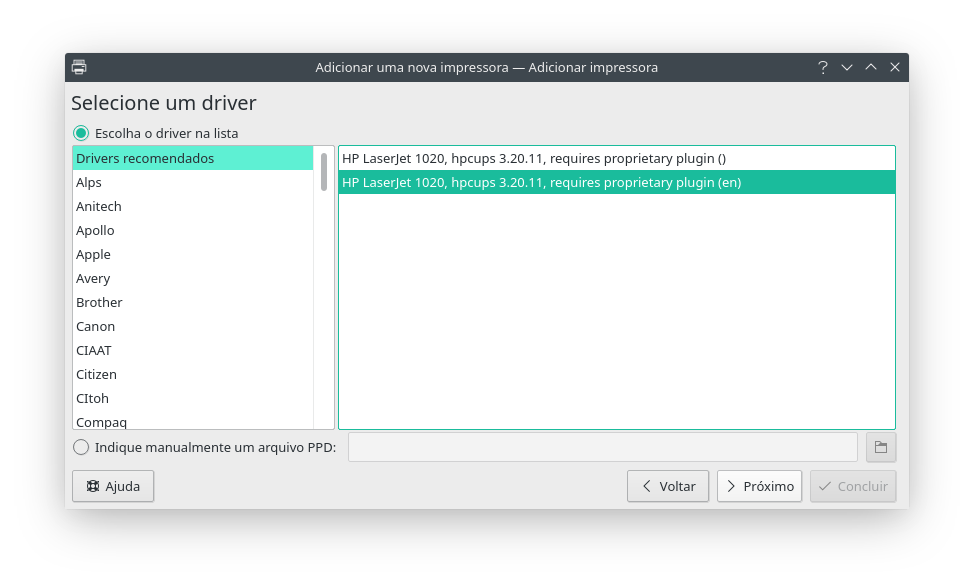

O suporte a impressoras HP do Manjaro inclui um software chamado HP Device Manager, disponível no menu do sistema operacional.

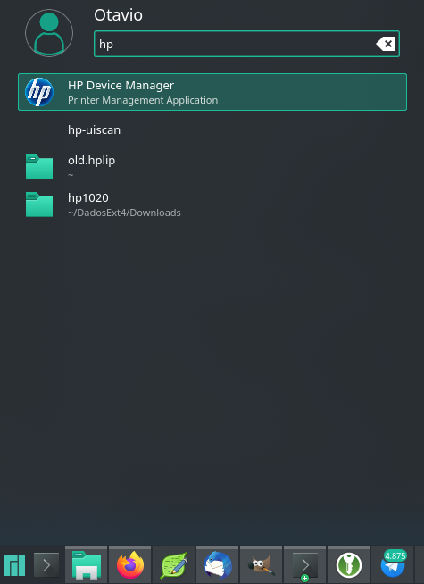

Esse software inclui algumas opções da impressora, inclusive um utilitário para instalar o tal plugin proprietário. Esta opção equivale a executar o comando "hp-plugin" na linha de comando.

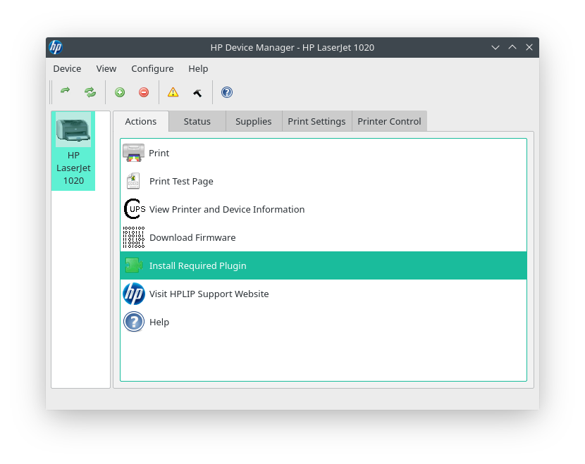

Ao comandar a instalação do plugin, é apresentada a opção de fazer download automático do plugin (recomendado).

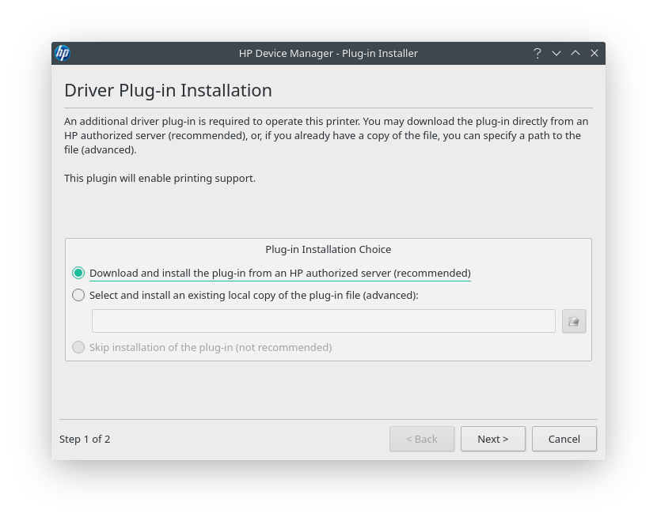

O problema é que o repositório desse plugin às vezes fica indisponível (comigo ocorre todas as vezes que preciso instalar a impressora por qualquer razão). Acredito que sejam atualizações no site do HP que acabem gerando uma reorganização do conteúdo e quebrando os links para os plugins.

O erro que ele apresenta é "file does not match its checksum. File may have been corrupted or altered". Em tradução livre, "o arquivo não combina com seu checksum. Arquivo pode ter sido corrompido ou alterado". Na verdade, na verdade, o software não conseguiu nem baixar o checksum, acredito eu.

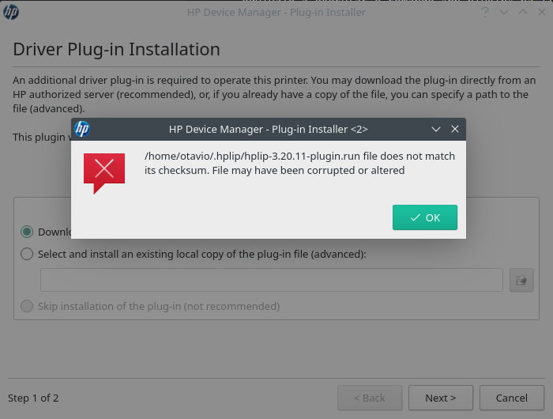

Para conseguir instalar a impressora, você precisa, então, utilizar a opção de selecionar e instalar uma cópia existente do plugin. Mas antes você precisa baixar o plugin...

Para nossa sorte existe o projeto [Open Printing](https://openprinting.github.io/). Esse projeto mantém uma base de drivers de impressoras (chamado foomatic) e tem um repositório com os tais plugins proprietários de que precisamos.

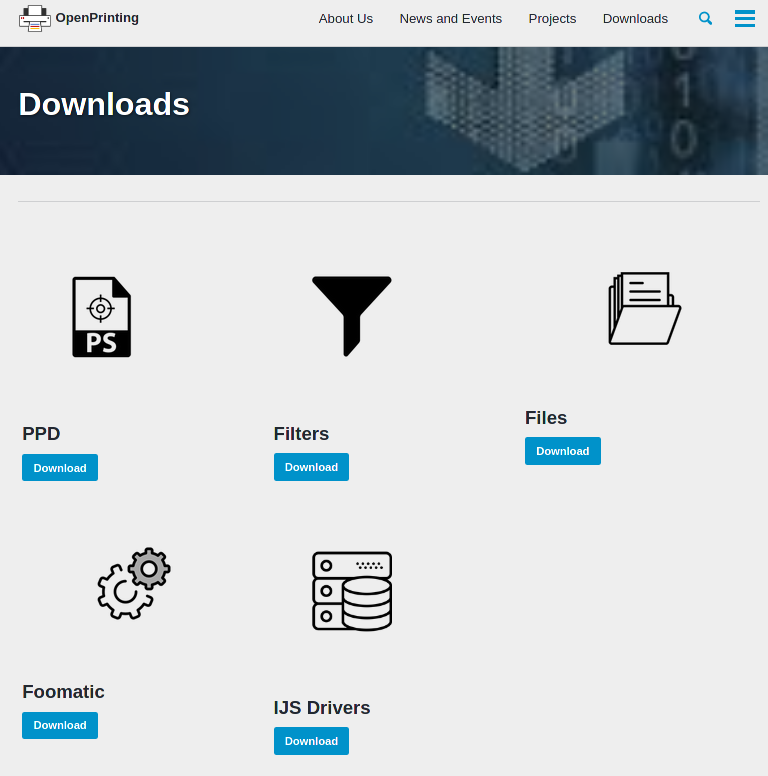

A sessão de downloads do site da Open Printing tem várias categorias. No momento em que escrevo, os plugins da HP estão na sessão genérica, chamada ["Files"](http://www.openprinting.org/download/printdriver/auxfiles/HP/plugins/).

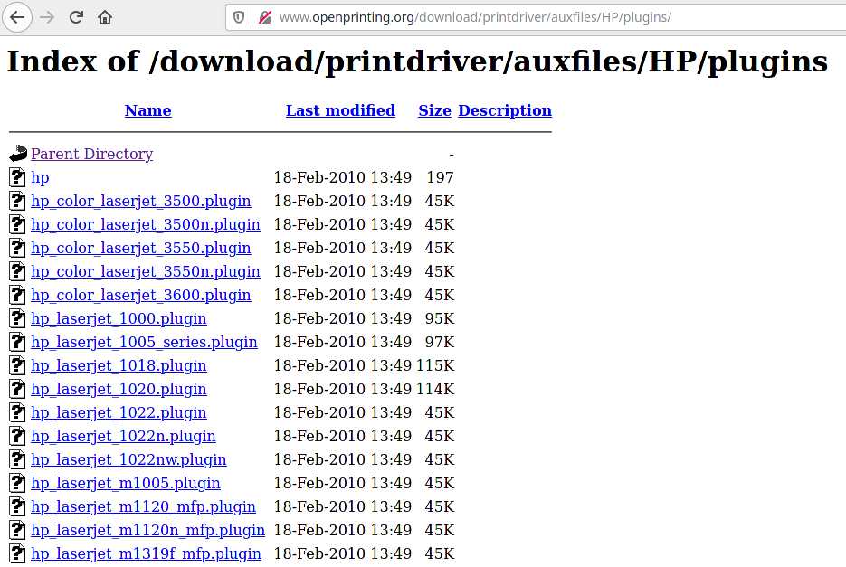

Os arquivos que você precisa baixar são dois: um terminado com ".plugin.run" e seu equivalente terminado em ".plugin.run.asc". O arquivo ".run" é um shell script gigantesco (11MB). O arquivo ".asc" é o tal checksum que o software usa para validar.

Você pode ficar tentado a baixar a versão mais atual do plugin, mas você deve utilizar a mesma versão que o hplip instalado no seu sistema operacional. Essa versão aparece na mensagem de erro que inclui ali em cima, a tal mensagem do checksum. Mas não se preocupe, se baixar a versão errada, o sistema vai reclamar indicando que a sua versão não condiz com a instalada e indicando qual é qual.

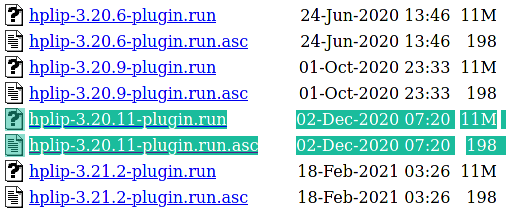

De posse do arquivo correto, você pode utilizar a opção de instalação do plugin a partir de um arquivo local.

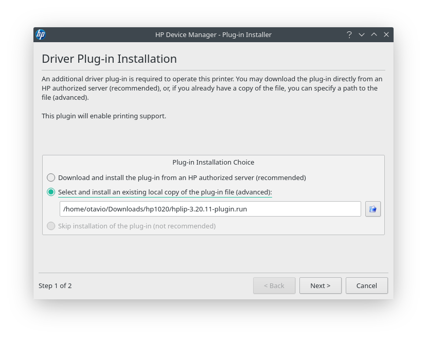

O software vai levar um tempo tentando se conectar com um servidor para validar o arquivo (2 ou 3 minutos) e depois desistir, perguntando se você concorda em instalar o plugin mesmo sem essa validação. Eu concordei.

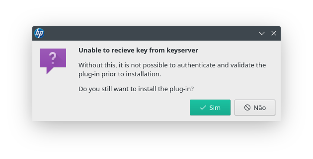

Em seguida, ele vai apresentar o contrato de licença para você avaliar se concorda ou não. Todo esse rolo foi por conta deste aceite, que você precisa fazer. É por causa dele que o processo não pode ser automático. Concordei também.

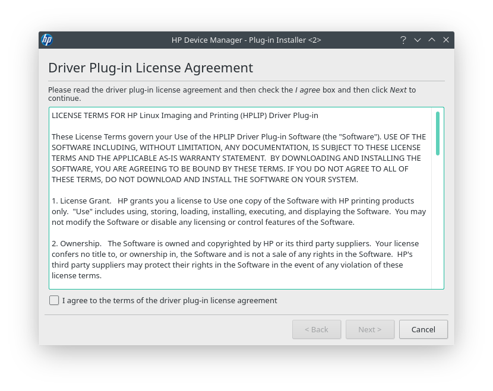

Feito isso, o software vai pedir sua senha para executar a instalação com privilégios de administrador e pronto!

Se tudo der certo, ao final da instalação você vai escutar o glorioso som de reinicialização da impressora, que indica que o firmware novo foi instalado.

Pode imprimir à vontade!

Artigos anteriores sobre isso:

[Economizando papel no
Linux](http://umcarneiro.blogspot.com/2013/07/economizando-papel-no-linux.html)

[Instalando impressora HP Laserjet 1020 no Debian Linux 7 (2014)](2014-11-27-Instalar-impressora-HP-Laserjet-1020-no-Debian-Linux-7.7-(Wheezy)-e-Debian-8-(Jessie))

